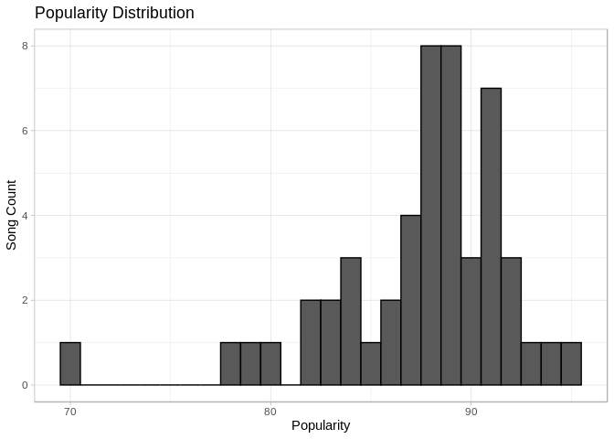
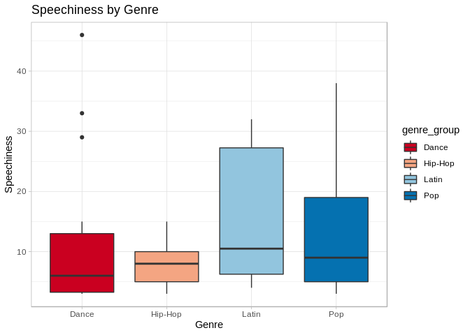

Top 50 Spotify Songs of 2019 - Exploratory Data Analysis
================
Rick Pohly
January 7, 2020

**MOTIVATION**

As a musician, I’m always interested in what drives today’s popular
music. Since the music industry has experienced a massive paradigm shift
towards streaming-based services over the last decade, a plethora of
data are now available for all sorts of interesting analyses. I
recognize that this dataset is tiny in scope (only 50 rows), but I chose
it specifically for that reason, as a load-light way to practice, being
a beginner in data science. I try to be careful not to draw any lofty
conclusions given the virtually microscopic scale of this dataset. This
is intended to be a very simple analysis for the purpose of getting the
feel of EDA.

**Loading Data**

We begin by loading libraries and the wrangled top50.rda file into the
object “topsongs” and converting the categorical genre variable to a
factor.

``` r
options(digits = 3)

# Load libraries and data
if(!require(ggplot2)){install.packages("ggplot2")}
```

    ## Loading required package: ggplot2

``` r
if(!require(dplyr)){install.packages("dplyr")}
```

    ## Loading required package: dplyr

    ## 
    ## Attaching package: 'dplyr'

    ## The following objects are masked from 'package:stats':
    ## 
    ##     filter, lag

    ## The following objects are masked from 'package:base':
    ## 
    ##     intersect, setdiff, setequal, union

``` r
if(!require(RColorBrewer)){install.packages("RColorBrewer")}
```

    ## Loading required package: RColorBrewer

``` r
load("rda/top50.rda")

# Convert categoricals to factors
topsongs <- topsongs %>% mutate_at(vars(genre), as.factor)
```

**Genre Grouping**

Having a closer look at the genre variable, we see that it contains 21
unique values. Upon inspection, it becomes clear that these are in fact
subgenres. Since the dataset is only 50 rows, it might be wise to group
these subgenres into the more general genres of pop, hip-hop, dance and
latin for better stratification
    later.

``` r
length(levels(topsongs$genre))
```

    ## [1] 21

``` r
levels(topsongs$genre)
```

    ##  [1] "atl hip hop"      "australian pop"   "big room"         "boy band"        
    ##  [5] "brostep"          "canadian hip hop" "canadian pop"     "country rap"     
    ##  [9] "dance pop"        "dfw rap"          "edm"              "electropop"      
    ## [13] "escape room"      "latin"            "panamanian pop"   "pop"             
    ## [17] "pop house"        "r&b en espanol"   "reggaeton"        "reggaeton flow"  
    ## [21] "trap music"

``` r
# Group subgenres into more general genres
topsongs <- topsongs %>% 
  mutate(genre_group = as.factor(case_when(
    genre %in% c("atl hip hop", "escape room", "canadian hip hop", 
                 "dfw rap", "country rap") ~ "Hip-Hop",
    genre %in% c("brostep", "australian pop", "canadian pop",
                 "panamanian pop", "boy band", "electropop",
                 "pop") ~ "Pop",
    genre %in% c("latin", "r&b en espanol", "reggaeton", 
                 "reggaeton flow") ~ "Latin",
    genre %in% c("dance pop", "pop house", "trap music", 
                 "big room", "edm") ~ "Dance")))
```

**Summarization**

Looking at a summary of the numeric variables, we see that there is not
a whole lot of variability for popularity. Values range from 70 to 95
with a mean value of 87.5 and a standard deviation of about 4.5. Most
songs have a popularity value of 88 and 89. This is not unexpected.
Since the dataset consists of the top 50 Spotify songs of 2019, it’s
safe to say that, by definition, *every* song is popular. Therefore, we
will ignore this variable as a consequence of this lack of signal.

``` r
# Summarize just the numeric data
summary(topsongs[,4:13])
```

    ##       bpm          energy      danceability     loudness         liveness   
    ##  Min.   : 85   Min.   :32.0   Min.   :29.0   Min.   :-11.00   Min.   : 5.0  
    ##  1st Qu.: 96   1st Qu.:55.2   1st Qu.:67.0   1st Qu.: -6.75   1st Qu.: 8.0  
    ##  Median :104   Median :66.5   Median :73.5   Median : -6.00   Median :11.0  
    ##  Mean   :120   Mean   :64.1   Mean   :71.4   Mean   : -5.66   Mean   :14.7  
    ##  3rd Qu.:138   3rd Qu.:74.8   3rd Qu.:79.8   3rd Qu.: -4.00   3rd Qu.:15.8  
    ##  Max.   :190   Max.   :88.0   Max.   :90.0   Max.   : -2.00   Max.   :58.0  
    ##     valence         length     acousticness   speechiness     popularity  
    ##  Min.   :10.0   Min.   :115   Min.   : 1.0   Min.   : 3.0   Min.   :70.0  
    ##  1st Qu.:38.2   1st Qu.:177   1st Qu.: 8.2   1st Qu.: 5.0   1st Qu.:86.0  
    ##  Median :55.5   Median :198   Median :15.0   Median : 7.0   Median :88.0  
    ##  Mean   :54.6   Mean   :201   Mean   :22.2   Mean   :12.5   Mean   :87.5  
    ##  3rd Qu.:69.5   3rd Qu.:218   3rd Qu.:33.8   3rd Qu.:15.0   3rd Qu.:90.8  
    ##  Max.   :95.0   Max.   :309   Max.   :75.0   Max.   :46.0   Max.   :95.0

``` r
sd(topsongs$popularity)
```

    ## [1] 4.49

``` r
# Peek at popularity distribution
topsongs %>% ggplot(aes(x = popularity)) +
  theme_light() +
  geom_histogram(col = "black", binwidth = 1) +
  labs(x = "Popularity", y = "Song Count") +
  ggtitle("Popularity Distribution")
```

<!-- -->

Stratifying by the generalized genre groups created earlier, we can gain
some interesting insights.

``` r
# Which is the most common genre of the top 50?
topsongs %>% ggplot(aes(x = genre_group)) +
  theme_minimal() +
  geom_bar(aes(fill = genre_group)) +
  scale_fill_brewer(palette = "RdBu") +
  labs(x = "Genre", y = "Song Count") +
  ggtitle("Song Counts by Genre")
```

<!-- -->

``` r
table(topsongs$genre_group)
```

    ## 
    ##   Dance Hip-Hop   Latin     Pop 
    ##      14       9      10      17

First, and perhaps unsurprisingly, most of the songs in the dataset (17)
fall into the category of pop, with dance a close a second, followed by
latin and lastly, hip-hop.

Next, let’s have a look at deeper look. The energy, bpm, speechiness and
loudness variables are of some interest. Is there a connection between
the amount of energy a song in a genre has and its speed or loudness? Is
this a commonality among hit songs in general? Will hip-hop be the song
with the highest speechiness value as we might expect?

``` r
energybox.plt <- topsongs %>% 
  ggplot(aes(x = genre_group, y = energy)) +
  theme_light() +
  geom_boxplot(aes(fill = genre_group)) + 
  scale_fill_brewer(palette = "RdBu") +
  labs(x = "Genre", y = "Energy") +
  ggtitle("Energy by Genre")
energybox.plt
```

<!-- -->

``` r
energydens.plt <- topsongs %>% 
  ggplot(aes(x = energy, fill = genre_group)) +
  theme_light() +
  geom_density(alpha = 0.4) + 
  scale_fill_brewer(palette = "RdBu") +
  labs(x = "Genre", y = "Energy") +
  ggtitle("Energy Density by Genre")
energydens.plt
```

<!-- -->

It is clear from these plots that latin music has the highest median
energy, and hip-hop the lowest. This could be a function of speed. We
plot bpm against energy for a more fine-grained exploration.

``` r
bpmenergy.plt <- topsongs %>% group_by(genre_group) %>%
  mutate(rho = cor(energy, bpm)) %>%
  ggplot(aes(x = bpm, y = energy)) +
  theme_light() +
  geom_point() +
  facet_wrap(genre_group ~ rho) +
  labs(x = "Beats Per Minute", y = "Energy") +
  ggtitle("Stratified BPM vs Energy")
bpmenergy.plt
```

<!-- -->

Keeping in mind that the data are very sparse, it appears that there is
little to no correlation between beats per minute and energy level, with
the noted exception of hip-hop. The rho value of hip-hop is around 0.57,
showing a slightly strong positive correlation. Whether or not this is
typical or simply due to lack of data remains to be seen.

Next, we have a look at loudness.

``` r
energyloud.plt <- topsongs %>%
  ggplot(aes(x = loudness, y = energy)) +
  theme_light() +
  geom_point(aes(color = genre_group), 
             alpha = 0.8) +
  scale_color_brewer(palette = "RdBu") +
  geom_smooth(method = "lm") +
  labs(x = "Loudness", y = "Energy") +
  ggtitle("Energy vs Loudness")
energyloud.plt
```

<!-- -->

Even with such little data, we can instantly make out a suggestively
strong positive correlation between energy and loudness, the strongest
by far. A basic linear model seems to fit this quite well. The
confidence interval is tightest at a loudness of about -6dB. Let’s check
the rho value to be sure.

``` r
cor(topsongs$loudness, topsongs$energy)
```

    ## [1] 0.671

The value of rho for these two variables is 0.671, suggesting that
loudness and energy are correlated. It is likely that if the dataset
were larger, this rho value would be even higher.

Turning now to speechiness, we discover something interesting.

``` r
speechbox.plt <- topsongs %>% ggplot(aes(x = genre_group, 
                        y = speechiness,
                        fill = genre_group)) +
  theme_light() +
  geom_boxplot() +
  scale_fill_brewer(palette = "RdBu") +
  labs(x = "Genre", y = "Speechiness") +
  ggtitle("Speechiness by Genre")
speechbox.plt
```

<!-- -->

It turns out that hip-hop does not have the highest speechiness value,
and in fact has the lowest mean speechiness value of all four genre
groups\!

``` r
topsongs %>% group_by(genre_group) %>%
  summarize(mean = mean(speechiness)) %>%
  arrange(desc(mean))
```

    ## # A tibble: 4 x 2
    ##   genre_group  mean
    ##   <fct>       <dbl>
    ## 1 Latin        16  
    ## 2 Pop          13.1
    ## 3 Dance        12.1
    ## 4 Hip-Hop       8

Latin music seems to take the lead in this category. Even dance music,
which we normally don’t think of as having much spoken word in at all,
surpasses hip-hop.

**CONCLUSION**

While most genres are of speeds and energy levels that span a larger
range, it is latin music that has the highest energy along with the
highest spoken word content. Hip-hop being a naturally spoken-word-based
genre, this is a surprising find. One possible explanation is that
hip-hop in recent years has shifted from the more rhythmic, spoken-word
format of the 1980s and 1990s to the auto-tuned, melodic format that
seems more prevalent today. In terms of predictive power, it is
difficult to come to any trustworthy conclusion due to the small size of
these data, but it is likely that loudness can be used to predict energy
given a more comprehensive and sizeable dataset.
